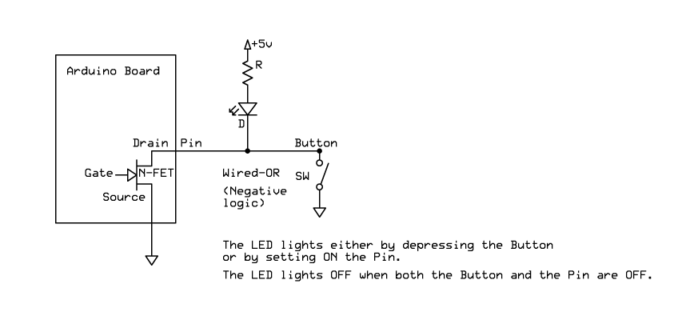

# jm_Pin - Allows digital emulated modes like Open-Drain

### Revisions

```
2017-10-18: v1.0.2 - Add supersede(). Update setup(), input(), output().
2017-09-05: v1.0.0 - Initial commit.
```

## Direct or Inverted Logic

### Direct positiv Logic

> `INPUT`

> `OUTPUT`

These modes are activ `HIGH` when pin is `+5V` and activ `LOW` when pin is `0V`.

### Inverted negativ Logic

> `INPUT_PULLUP`

> `OPEN_DRAIN`

These modes are activ `HIGH` when pin is `0V` and activ `LOW` when pin is `+5V`.

### Resume Logic

|Mode|State|Voltage|Input|Output|Pull-Up|Pull-Down|Open-Drain|N-FET|P-FET|Inv|Dir|
|:---:|:---:|:---:|:---:|:---:|:---:|:---:|:---:|:---:|:---:|:---:|:---:|
|INPUT|LOW|0V|0| | | | | | |0|0|
| |HIGH|+5V|1| | | | | | |0|0|
|OUTPUT|LOW|0V| |0| | | | | |0|1|
| |HIGH|+5V| |1| | | | | |0|1|
|INPUT_PULLUP|LOW|+5V|0| |1| | | | |1|0|
| |HIGH|0V|1| |1| | | | |1|0|
|OPEN_DRAIN|LOW|+5V| |0| | |1|1| |1|1|
| |HIGH|0V| |1| | |1|1| |1|1|

## Example jm_OD.ino



	#include <jm_Pin.h>
	
	jm_Pin Pin4(4, OPEN_DRAIN);
	
	bool state = false;
	word time0 = 0;
	
	void setup()
	{
		pinMode(13, OUTPUT);
	
		time0 = millis();
	}
	
	void loop()
	{
		state = !state;
		Pin4.output(state);
	
		do
			digitalWrite(13, Pin4.input());
		while ((word)millis() - time0 <= 500);
	
		time0 += 500;
	}
